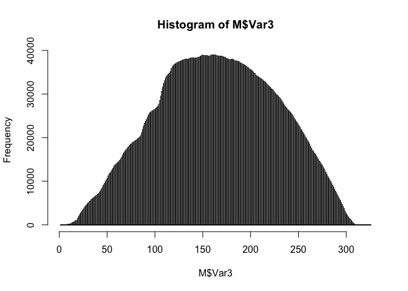

Building a 2D brain atlas in R
================
Giuseppe D’Agostino
5/21/2021

# Introduction

In this tutorial I will show you how to create your own brain atlas
visualization from scratch, using the latest release of the Allen Brain
Atlas parcellization.

The Allen Institute released in 2020 a [map of the left hemisphere of
the
human](https://community.brain-map.org/t/allen-human-reference-atlas-3d-2020-new/405)
brain as a NIfTI file. This file contains 3D coordinates of voxels, each
annotated as belonging to a specific brain structure.

It is possible to read and most importantly manipulate this map in R,
using a combination of data analysis and image processing techniques.
The end goal is to create easily visualizations of the brain regions
that can be combined with any dataset, as long as a clear relationship
between the dataset and the brain regions can be established.

I will go through all the passages from reading the file to wrangling it
in order to extract the relevant information; how to reconstruct region
polygons automatically for every brain slice, and how to visualize your
own data.

# Data loading and wrangling

The first thing we have to do is unpack the NIfTI file so that we
retrieve the 3D array containing voxel data.

We can think of this array as a cube that can be sliced in 3 directions;
conveniently, every direction represents an anatomical axis. If we slice
along the first axis of the cube we get images of the sagittal plane; if
we slice along the second axis we get images of the coronal plane, and
the 3rd axis shows the axial plane.

The important aspect of this 3D array is that every voxel has a number
or “annotation code”, which corresponds to the Allen Brain Atlas
structure ontology.

We read the data using the `oro.nifti` package and extract the array
using `img_data()`

``` r
library(oro.nifti)
```

    ## oro.nifti 0.11.0

``` r
nifti <- readNIfTI("annotation.nii.gz")

brain <- img_data(nifti)
class(brain)
```

    ## [1] "array"

It is easier to understand this file if we convert it to a long format,
i.e. a table in which every point has a row, with 4 columns: its x, y, z
coordinates, and the value (annotation code).

This is easily achieved by using the `melt()` function from the
`reshape2` package.

``` r
library(reshape2)

M = melt(brain)

head(M)
```

    ##   Var1 Var2 Var3 value
    ## 1    1    1    1     0
    ## 2    2    1    1     0
    ## 3    3    1    1     0
    ## 4    4    1    1     0
    ## 5    5    1    1     0
    ## 6    6    1    1     0

Many of these voxels have an value of 0. This means they are empty,
i.e. they fill the space of the rectangular box around the brain array,
and we don’t need to include them. We cannot remove them from the array
(else it would lose its structure), but we can remove them from the long
format “molten” table.

``` r
M <- M[M$value > 0,]
```

Previous work on this dataset has alerted me to the fact that there are
some “outlier” voxels that are completely out of the brain area. We can
easily verify this by looking at histograms of the coordinates for every
axis: if there are voxels that are significantly far away from the main
mass they will show up in the histogram for at least one of the axes.

``` r
hist(M$Var1, breaks = 10000)
```

<!-- -->

``` r
hist(M$Var2, breaks = 10000)
```

<!-- -->

``` r
hist(M$Var3, breaks = 10000)
```

<!-- -->

``` r
# Let's zoom in for the first and third axes
hist(M$Var1, ylim = c(0, 10))
```

<!-- -->

``` r
hist(M$Var3, ylim = c(0, 10), xlim = c(300, 320))
```

<!-- -->

``` r
# We cut below 100 or above 315 (the points are the same ones)
M[M$Var1 < 100,]
```

    ##          Var1 Var2 Var3 value
    ## 59589755   13  260  325 10368
    ## 59589756   14  260  325 10368
    ## 59773359   13  260  326 10368
    ## 59773360   14  260  326 10368

``` r
M[M$Var3 > 315,]
```

    ##          Var1 Var2 Var3 value
    ## 59589755   13  260  325 10368
    ## 59589756   14  260  325 10368
    ## 59773359   13  260  326 10368
    ## 59773360   14  260  326 10368

It looks like at least 4 points are clearly outliers. There are a couple
more, which we can see more clearly with a 3D visualization which we
will cover in another tutorial.

``` r
indices.remove <- c(59589755, 59589756, 59773359, 59773360, 46299, 46693)

brain[t(indices.remove)] <- 0

M = reshape2::melt(brain)
M <- M[M$value > 0,]
```

The `M` data frame contains 4 columns: `Var1`, `Var2`, `Var3` represent
the 3 axes (x, y, and z or sagittal, coronal, and axial), whereas
`value` contains the structure annotation id. So if we keep the value
for one axis constant, and plot the other ones, we can have one “slice”
of the array.

As an example, here’s a plot of one sagittal slice:

``` r
plot(M[M$Var1 == 200, 2:3], 
     col = "gray", 
     pch = 16, 
     cex = 0.3, 
     main = "Sagittal slice 200")
```

<!-- -->

We can also isolate structures by subsetting on values of `value`:

``` r
plot(M[M$Var1 == 200, 2:3], col = "gray", 
     pch = 16, cex = 0.3,
     main = "Sagittal slice 200 - Structure 12158")

points(M[M$Var1 == 200 & M$value == "12158", 2:3], 
       col = "deepskyblue", 
       pch = 16, 
       cex = 0.3)
```

<!-- -->

# Retrieving structural metadata

At this point we need to retrieve the information on structures, as a
way to map the annotation ids (the `value` column in `M`) to actual
parcellations. For this we will access the Allen Brain Institute API
using `httr`:

``` r
library(httr)

anno <- data.frame("id" = unique(M$value), 
                   stringsAsFactors = FALSE)

anno <- anno[anno$id != 0, , drop = FALSE]  

# Information available on the ABI website
requested.data <- GET(paste0("http://api.brain-map.org/api/v2/data/query.json?criteria=model::Structure,",
                             "rma::criteria,[graph_id$eq16],",
                             "rma::options[order$eq%27structures.graph_order%27][num_rows$eqall]"))

# Unpacking the request results
request.data.content <- content(requested.data)

structures <- as.data.frame(
  do.call(rbind, lapply(request.data.content$msg, as.character)), 
  stringsAsFactors = FALSE)

# Additional wrangling
colnames(structures) <- names(request.data.content$msg[[1]])

structures.available <- structures[structures$id %in% unique(anno$id),]

head(structures.available)
```

    ##      acronym atlas_id color_hex_triplet depth failed failed_facet graph_id
    ## 1588      FI     NULL            C1A68F     9  FALSE    734881840       16
    ## 1594      TI     NULL            B5967F     9  FALSE    734881840       16
    ## 1733      OB     NULL            D1CEE2     9  FALSE    734881840       16
    ## 1740     AON     NULL            AA9DC6     9  FALSE    734881840       16
    ## 1752     Pir     NULL            AA9DC6     9  FALSE    734881840       16
    ## 1761     AMY     NULL            C9E2B1     7  FALSE    734881840       16
    ##      graph_order hemisphere_id    id
    ## 1588        1587             3 10329
    ## 1594        1593             3 10330
    ## 1733        1732             3 10307
    ## 1740        1739             3 10308
    ## 1752        1751             3 10311
    ## 1761        1760             3 10361
    ##                                             name neuro_name_structure_id
    ## 1588  frontal agranular insular cortex (area FI)                    NULL
    ## 1594 temporal agranular insular cortex (area TI)                    NULL
    ## 1733                              olfactory bulb                    NULL
    ## 1740                  anterior olfactory nucleus                    NULL
    ## 1752                             piriform cortex                    NULL
    ## 1761                          amygdaloid complex                    NULL
    ##      neuro_name_structure_id_path ontology_id parent_structure_id
    ## 1588                         NULL          11               10327
    ## 1594                         NULL          11               10327
    ## 1733                         NULL          11               10306
    ## 1740                         NULL          11               10306
    ## 1752                         NULL          11               10306
    ## 1761                         NULL          11               10331
    ##                                        safe_name sphinx_id st_level
    ## 1588  frontal agranular insular cortex (area FI)      8187     NULL
    ## 1594 temporal agranular insular cortex (area TI)      8193     NULL
    ## 1733                              olfactory bulb      8332     NULL
    ## 1740                  anterior olfactory nucleus      8339     NULL
    ## 1752                             piriform cortex      8351     NULL
    ## 1761                          amygdaloid complex      8360     NULL
    ##                                                  structure_id_path
    ## 1588 /10153/10154/10155/10156/10157/10158/10159/10313/10327/10329/
    ## 1594 /10153/10154/10155/10156/10157/10158/10159/10313/10327/10330/
    ## 1733 /10153/10154/10155/10156/10157/10158/10159/10292/10306/10307/
    ## 1740 /10153/10154/10155/10156/10157/10158/10159/10292/10306/10308/
    ## 1752 /10153/10154/10155/10156/10157/10158/10159/10292/10306/10311/
    ## 1761             /10153/10154/10155/10156/10157/10158/10331/10361/
    ##      structure_name_facet weight
    ## 1588           1101825180   8660
    ## 1594           2127391511   8660
    ## 1733           1746943475   8660
    ## 1740           2739385054   8660
    ## 1752            524550472   8660
    ## 1761           3865625403   8660

We can see that the `structures.available` object has many useful
fields, including the Allen color scheme and other data on their
structural ontology graph. We mostly care about the correspondence
between `id`, `name`, `color_hex_triplet` and `acronym`.

# Slicing the array

Now that we have prepared our data, we can start extracting the useful
bits.

We start by slicing the array on the sagittal plane, i.e. along the
first dimension. To do so we use a loop to subset the table taking all
the rows that have the same value for the first column `Var1`. This is
equivalent to moving by steps of 1 voxel in the sagittal plane.

The loop first creates a list in which every element contains all the
voxels in a given slice. Then, an additional loop isolates each
structure creating a nested list. The main list contains slices, and
each slice contains a list of structures. Within this list, every
structure should be named so that it can be later selected or colored
according to the structural ontology.

``` r
# Divide the array in 1 voxel slices along the sagittal plane
sagittal_plane <- lapply(unique(M$Var1), 
                         function(x) M[M$Var1 == x, ])

# Subdivide each slice in a list of structures
sagittal_strlist <- lapply(sagittal_plane, function(x) lapply(unique(x$value), 
                                                              function(y)  df = x[x$value == y,]))

# Naming structures using their codes 
for(i in 1:length(sagittal_strlist)) {
    names(sagittal_strlist[[i]]) <- unlist(lapply(sagittal_strlist[[i]], 
                                                  function(x) unique(x$value)))
}

# Naming slices
names(sagittal_strlist) <- unique(M$Var1)

# Saving the file
saveRDS(sagittal_strlist, file = "sagittal_strlist.RDS")
```

Now that we have a nested list with all the structures in each slice, we
can clean it up. We remove the small structures (less than 3 voxels) as
they will be problematic when it comes to drawing polygons and plotting
them. Importantly we do not eliminate a whole structure from the brain;
we just remove them from slices in which they are too small.

``` r
# Naming list elements and removing small structures ( < 3 voxels)
# Get for each slice the structures with fewer than 3 rows (voxels)

dims <- lapply(sagittal_strlist, function(x) lapply(x, 
                                                    function(y) nrow(y) < 3))
names(dims) <- 1:length(dims)

# Name elements to  be removed
for(i in 1:length(dims)) names(dims[[i]]) <- 1:length(dims[[i]])

# Mark structures for removal
dims_remove <- unlist(lapply(dims, 
                             function(x) which(x == TRUE)))

# Keep track of the structures that are being removed
dims_remove_table <- t(matrix(as.numeric(sapply(names(dims_remove), 
                                                function(x) unlist(strsplit(x, split = "[.]")))), nrow = 2))

# Remove structures
for(i in 1:nrow(dims_remove_table)) {
  sagittal_strlist[[dims_remove_table[i,1]]][[dims_remove_table[i,2]]] <- NULL
}

# Loop again to check if other structures need to be removed (will throw an error that can be ignored)
while(nrow(dims_remove_table > 1)){
  dims <- lapply(sagittal_strlist, function(x) 
    lapply(x, function(y) nrow(y) < 3))
  
  names(dims) <- 1:length(dims)
  
  for(i in 1:length(dims)) names(dims[[i]]) <- 1:length(dims[[i]])
  
  dims_remove <- unlist(lapply(dims, function(x) which(x == TRUE)))
  dims_remove_table <- t(matrix(as.numeric(sapply(names(dims_remove), 
                                                  
                                                  function(x) unlist(strsplit(x, split = "[.]")))), nrow = 2))
  
  for(i in 1:nrow(dims_remove_table)) {
    sagittal_strlist[[dims_remove_table[i,1]]][[dims_remove_table[i,2]]] <- NULL
  }
}
```

    ## Error in dims_remove_table[i, 1]: subscript out of bounds

# Structure edge detection and polygon drawing

Now that the structures have been pruned, we can proceed with the next
steps.

The final goal we have is to plot one particular slice, and then plot
all the structures within that slice, in 2 dimensions. We could already
do that by plotting all points on a 2D plot, and assigning them a colour
according to their structure.

However, this has some big limitations:

1)  the `M` data frame is rather large
2)  plots made of points are very inconvenient to work with in vector
    graphics programs as they don’t actually cover a surface (not to
    mention the amount of space they take)
3)  point clouds cannot be easily contoured by using standard plotting
    functions (e.g. setting some sort of `border` attribute)

So it would be very convenient to render structures as polygons rather
than just collections of points: they are more lightweight, they can be
plotted more easily, and maintain their density when exported as vector
graphics. However, creating polygons from sets of points is not a
trivial task.

First, we have to consider that the voxels belonging to each structure
may not all lie in the same contiguous space. This means that even if
the structure is one, its appearance in one slide can be divided in
several sub-polygons.

Second, these polygons will be convoluted and show concavities, which
poses an additional challenge when we want to compute these shapes
automatically.

The proposed workflow is then as follows:

1)  edge points for each structure are detected using an edge detection
    algorithm. This algorithm will only return points, which still need
    to be joined within polygons.

2)  points need to be grouped within each structure so that we will not
    be drawing polygons encompassing structures that are actually
    disjointed.

3)  once points are grouped, they still need to be joined to form
    polygons. R requires poitns to be ordered to know how a polygons is
    drawn. This is the most challenging part, as, even with a unique set
    of edge points, their concave hulls (lines enclosing all points that
    follow their general shape) may not be unique.

4)  polygons are optionally smoothed.

Let’s look at the options we have for each point.

1)  There are several methods to detect edges in images, as it is a very
    important feature of computer vision. We are dealing here with a
    relatively simple problem, since our images are, for all intents and
    purposes, binary: either a voxel is assigned to a structure, or is
    0. A simple solution would be to pad each structure with extra
    voxels valued 0, then calculate the euclidean distance of all the
    structure voxels to the 0 voxels, and only keep structure voxels
    that have at least one 0 voxel as their nearest neighbor. As simple
    as this solution is, it is very time consuming. As an alternative,
    we can still make use of fast algorithms such as the Sobel operator
    for edge detection, even though they were designed for grayscale
    images and apply denoising techniques and Gaussian kernels for this
    purpose. We still draw the bounding box, and we apply the algorithm
    to each structure and its 0-vaued box. Importantly, some of the edge
    points will be found on the padding area, so we can still subset the
    Sobel edges by choosing only those that were part of the structure
    to begin with.

2)  The solution for this problem is straightforward: edge points are
    clustered using single-linkage hierarchical clustering via
    `hclust()`, and cutting the tree at a suitable height using
    `cutree()`. We exploit the fact that voxels are regularly spaced, so
    that the height at which we decide to cut the three is the minimum
    height at which two points forming a continuous shape are likely to
    be. Laterally/vertically adjacent points are separated by a distance
    of 1, whereas diagonally adjacent points will be separated by a
    distance equal to the square root of 2 (\~1.41). Since the edge
    point detection algorithm may not be perfect according to the
    parameters we use, we can decide to be more tolerant and cut the
    tree at a height of 3 units.

3)  There are two possible solutions (that I can think of) to this
    problem: one is very slow, but quite precise; the other one is very
    fast but can create artifacts. For the sake of speed I have
    implemented only the second one. The slow but precise solution
    consists in creating a graph containing all edge points in which
    edges are drawn only within a certain tolerance (e.g. 3 units). Then
    we treat the polygon drawing as a Travelling Salesman Problem (TSP):
    finding the shortest path that visits all nodes of the graph exactly
    once. There are several algorithms to solve the TSP, but they are
    admittedly slow when applied at this scale, especially considering
    that it is an NP-hard problem. The fast, but imprecise solution
    consists in applying a [concave
    hull](https://en.wikipedia.org/wiki/Alpha_shape) detection algorithm
    using `concaveman()` from the homonymous package. This algorithm is
    very effective at finding shapes, but can be somewhat crude in
    regions with convoluted concavities (e.g. cortical or cerebellar
    sulci). The speed advantage is very good if you want to do this on
    your own laptop, but keep in mind shapes may not be perfect.

4)  Another straightforward solution: we can use any 2D smoothing
    package, such as `smoothr`.

We write a custom function that uses `OpenImageR` to apply [Sobel edge
detection](https://en.wikipedia.org/wiki/Sobel_operator) to each
polygon.

Briefly, the Sobel filter assumes that points in an image belong to some
differentiable function, of which these points are just samples. After a
pre-processing step of denoising and smoothing, the Sobel filter uses
two 3x3 kernels (one for the x axis and one for the y axis), to
approximate the image gradient at every point, and determines points
that have “abrupt changes” in intensity in the x and/or y direction. A
gradient value of 0 means the pixel is within a constant luminance area
(light or dark), whereas gradient values above 0 indicate changes in
luminance in the adjacent pixels.

We are dealing with a binary image, so the Sobel filter may be overkill;
however it is very fast and can be applied very easily to our case.

Each step of the function is explained in the comments:

``` r
edge_det_sobel <- function(y, plane = "sagittal"){
  
  # Change coordinate choice according to the plane
  if(plane == "sagittal") {
    coords = c("Var2","Var3")
     } else if(plane == "coronal") {
    coords = c("Var1", "Var3")
     } else if(plane == "axial") {
    coords = c("Var1", "Var2")
     }
  
  # Draw a bounding box padding empty voxels with 0s
    bounding_box <- c(range(y[,coords[1]]), range(y[,coords[2]])) + c(-1, 1, -1, 1)
    
    bounding_box_filled <- expand.grid(c(bounding_box[1]:bounding_box[2]), 
                                       c(bounding_box[3]:bounding_box[4]))
    
    colnames(bounding_box_filled) <- coords
    
    bounding_box_all <- rbind(bounding_box_filled, 
                              y[,coords])
    
    bounding_box_all$value <- 1
    
  # Box is filled with 0
    bounding_box_all$value[1:nrow(bounding_box_filled)] <- 0
    
  # Remove duplicates, i.e. 0-valued voxels that occupy the space of the structure
    bounding_box_all <- bounding_box_all[-1 * which(duplicated(bounding_box_all[,1:2], fromLast = TRUE)),]
    
  # Sobel works on matrices, not on tables: we need to recast the molten data frame in 2 dimensions  
    bounding_box_all_mat <- as.matrix(reshape2::acast(bounding_box_all, 
                                                      formula = as.formula(paste(coords, collapse = "~"))))
    
  # The result is molten back in a data frame for easy row subsetting
    edges <- reshape2::melt(OpenImageR::edge_detection(bounding_box_all_mat, method = "Sobel"))
    
  # Soft threshold: we don't keep all the edge points, only the ones > 0.5  
    edges <- edges[edges$value > 0.5,]
    
  # Use the rownames of the data frame to subset the bounding box matrix, melting again
    edgeframe <-reshape2::melt(bounding_box_all_mat)[rownames(edges),]
    
  # Keep only points that were originally part of the structure  
   edgeframe <- edgeframe[edgeframe$value == 1,]
   
  # Remove edges that are made up of too few points
   if(nrow(edgeframe) > 3) return(edgeframe) else return(NULL)
  }
```

Now we can apply this function using a loop, which is a slow and
inefficient implementation, but fast enough and convenient to check its
progress. The loop containts another loop (through `lapply()`) which
will create lists of edge points within each slide. The structure is
still the same as before - list of slices, each slice a list of
structures - but instead of having all voxels we only keep the edge
points.

``` r
sagittal_strlist_edges <- list()

for(i in 1:length(sagittal_strlist)) { 
  print(paste0("Detecting edges in slice #", i, " of ", length(sagittal_strlist))) 
  
  sagittal_strlist_edges[[i]] <- lapply(sagittal_strlist[[i]], 
                                        edge_det_sobel)
  
  names(sagittal_strlist_edges[[i]]) <- names(sagittal_strlist[[i]])
}
```

    ## [1] "Detecting edges in slice #1 of 146"
    ## [1] "Detecting edges in slice #2 of 146"
    ## [1] "Detecting edges in slice #3 of 146"
    ## [1] "Detecting edges in slice #4 of 146"
    ## [1] "Detecting edges in slice #5 of 146"
    ## [1] "Detecting edges in slice #6 of 146"
    ## [1] "Detecting edges in slice #7 of 146"
    ## [1] "Detecting edges in slice #8 of 146"
    ## [1] "Detecting edges in slice #9 of 146"
    ## [1] "Detecting edges in slice #10 of 146"
    ## [1] "Detecting edges in slice #11 of 146"
    ## [1] "Detecting edges in slice #12 of 146"
    ## [1] "Detecting edges in slice #13 of 146"
    ## [1] "Detecting edges in slice #14 of 146"
    ## [1] "Detecting edges in slice #15 of 146"
    ## [1] "Detecting edges in slice #16 of 146"
    ## [1] "Detecting edges in slice #17 of 146"
    ## [1] "Detecting edges in slice #18 of 146"
    ## [1] "Detecting edges in slice #19 of 146"
    ## [1] "Detecting edges in slice #20 of 146"
    ## [1] "Detecting edges in slice #21 of 146"
    ## [1] "Detecting edges in slice #22 of 146"
    ## [1] "Detecting edges in slice #23 of 146"
    ## [1] "Detecting edges in slice #24 of 146"
    ## [1] "Detecting edges in slice #25 of 146"
    ## [1] "Detecting edges in slice #26 of 146"
    ## [1] "Detecting edges in slice #27 of 146"
    ## [1] "Detecting edges in slice #28 of 146"
    ## [1] "Detecting edges in slice #29 of 146"
    ## [1] "Detecting edges in slice #30 of 146"
    ## [1] "Detecting edges in slice #31 of 146"
    ## [1] "Detecting edges in slice #32 of 146"
    ## [1] "Detecting edges in slice #33 of 146"
    ## [1] "Detecting edges in slice #34 of 146"
    ## [1] "Detecting edges in slice #35 of 146"
    ## [1] "Detecting edges in slice #36 of 146"
    ## [1] "Detecting edges in slice #37 of 146"
    ## [1] "Detecting edges in slice #38 of 146"
    ## [1] "Detecting edges in slice #39 of 146"
    ## [1] "Detecting edges in slice #40 of 146"
    ## [1] "Detecting edges in slice #41 of 146"
    ## [1] "Detecting edges in slice #42 of 146"
    ## [1] "Detecting edges in slice #43 of 146"
    ## [1] "Detecting edges in slice #44 of 146"
    ## [1] "Detecting edges in slice #45 of 146"
    ## [1] "Detecting edges in slice #46 of 146"
    ## [1] "Detecting edges in slice #47 of 146"
    ## [1] "Detecting edges in slice #48 of 146"
    ## [1] "Detecting edges in slice #49 of 146"
    ## [1] "Detecting edges in slice #50 of 146"
    ## [1] "Detecting edges in slice #51 of 146"
    ## [1] "Detecting edges in slice #52 of 146"
    ## [1] "Detecting edges in slice #53 of 146"
    ## [1] "Detecting edges in slice #54 of 146"
    ## [1] "Detecting edges in slice #55 of 146"
    ## [1] "Detecting edges in slice #56 of 146"
    ## [1] "Detecting edges in slice #57 of 146"
    ## [1] "Detecting edges in slice #58 of 146"
    ## [1] "Detecting edges in slice #59 of 146"
    ## [1] "Detecting edges in slice #60 of 146"
    ## [1] "Detecting edges in slice #61 of 146"
    ## [1] "Detecting edges in slice #62 of 146"
    ## [1] "Detecting edges in slice #63 of 146"
    ## [1] "Detecting edges in slice #64 of 146"
    ## [1] "Detecting edges in slice #65 of 146"
    ## [1] "Detecting edges in slice #66 of 146"
    ## [1] "Detecting edges in slice #67 of 146"
    ## [1] "Detecting edges in slice #68 of 146"
    ## [1] "Detecting edges in slice #69 of 146"
    ## [1] "Detecting edges in slice #70 of 146"
    ## [1] "Detecting edges in slice #71 of 146"
    ## [1] "Detecting edges in slice #72 of 146"
    ## [1] "Detecting edges in slice #73 of 146"
    ## [1] "Detecting edges in slice #74 of 146"
    ## [1] "Detecting edges in slice #75 of 146"
    ## [1] "Detecting edges in slice #76 of 146"
    ## [1] "Detecting edges in slice #77 of 146"
    ## [1] "Detecting edges in slice #78 of 146"
    ## [1] "Detecting edges in slice #79 of 146"
    ## [1] "Detecting edges in slice #80 of 146"
    ## [1] "Detecting edges in slice #81 of 146"
    ## [1] "Detecting edges in slice #82 of 146"
    ## [1] "Detecting edges in slice #83 of 146"
    ## [1] "Detecting edges in slice #84 of 146"
    ## [1] "Detecting edges in slice #85 of 146"
    ## [1] "Detecting edges in slice #86 of 146"
    ## [1] "Detecting edges in slice #87 of 146"
    ## [1] "Detecting edges in slice #88 of 146"
    ## [1] "Detecting edges in slice #89 of 146"
    ## [1] "Detecting edges in slice #90 of 146"
    ## [1] "Detecting edges in slice #91 of 146"
    ## [1] "Detecting edges in slice #92 of 146"
    ## [1] "Detecting edges in slice #93 of 146"
    ## [1] "Detecting edges in slice #94 of 146"
    ## [1] "Detecting edges in slice #95 of 146"
    ## [1] "Detecting edges in slice #96 of 146"
    ## [1] "Detecting edges in slice #97 of 146"
    ## [1] "Detecting edges in slice #98 of 146"
    ## [1] "Detecting edges in slice #99 of 146"
    ## [1] "Detecting edges in slice #100 of 146"
    ## [1] "Detecting edges in slice #101 of 146"
    ## [1] "Detecting edges in slice #102 of 146"
    ## [1] "Detecting edges in slice #103 of 146"
    ## [1] "Detecting edges in slice #104 of 146"
    ## [1] "Detecting edges in slice #105 of 146"
    ## [1] "Detecting edges in slice #106 of 146"
    ## [1] "Detecting edges in slice #107 of 146"
    ## [1] "Detecting edges in slice #108 of 146"
    ## [1] "Detecting edges in slice #109 of 146"
    ## [1] "Detecting edges in slice #110 of 146"
    ## [1] "Detecting edges in slice #111 of 146"
    ## [1] "Detecting edges in slice #112 of 146"
    ## [1] "Detecting edges in slice #113 of 146"
    ## [1] "Detecting edges in slice #114 of 146"
    ## [1] "Detecting edges in slice #115 of 146"
    ## [1] "Detecting edges in slice #116 of 146"
    ## [1] "Detecting edges in slice #117 of 146"
    ## [1] "Detecting edges in slice #118 of 146"
    ## [1] "Detecting edges in slice #119 of 146"
    ## [1] "Detecting edges in slice #120 of 146"
    ## [1] "Detecting edges in slice #121 of 146"
    ## [1] "Detecting edges in slice #122 of 146"
    ## [1] "Detecting edges in slice #123 of 146"
    ## [1] "Detecting edges in slice #124 of 146"
    ## [1] "Detecting edges in slice #125 of 146"
    ## [1] "Detecting edges in slice #126 of 146"
    ## [1] "Detecting edges in slice #127 of 146"
    ## [1] "Detecting edges in slice #128 of 146"
    ## [1] "Detecting edges in slice #129 of 146"
    ## [1] "Detecting edges in slice #130 of 146"
    ## [1] "Detecting edges in slice #131 of 146"
    ## [1] "Detecting edges in slice #132 of 146"
    ## [1] "Detecting edges in slice #133 of 146"
    ## [1] "Detecting edges in slice #134 of 146"
    ## [1] "Detecting edges in slice #135 of 146"
    ## [1] "Detecting edges in slice #136 of 146"
    ## [1] "Detecting edges in slice #137 of 146"
    ## [1] "Detecting edges in slice #138 of 146"
    ## [1] "Detecting edges in slice #139 of 146"
    ## [1] "Detecting edges in slice #140 of 146"
    ## [1] "Detecting edges in slice #141 of 146"
    ## [1] "Detecting edges in slice #142 of 146"
    ## [1] "Detecting edges in slice #143 of 146"
    ## [1] "Detecting edges in slice #144 of 146"
    ## [1] "Detecting edges in slice #145 of 146"
    ## [1] "Detecting edges in slice #146 of 146"

``` r
names(sagittal_strlist_edges) <- names(sagittal_strlist)

  # Only keep structure lists that are not NULL
for(i in 1:length(sagittal_strlist)) {   
  
  sagittal_strlist_edges[[i]] <- sagittal_strlist_edges[[i]][unlist(lapply(sagittal_strlist_edges[[i]], 
                                                                           function(x) X = !is.null(x)))]
 
}
```

We can see how the edge detection performed for one particular
structure:

``` r
plot(M[M$Var1 == 200, 2:3], 
     col = "gray", 
     pch = 16, cex = 0.2, 
     main = "Sagittal slice 200 - Structure 12158")

points(M[M$Var1 == 200 & M$value == "12158", 2:3], 
       col = "deepskyblue", 
       pch = 16, 
       cex = 0.3) 

points(sagittal_strlist_edges[["200"]][["12158"]][,1:2], 
       pch = 16, 
       cex = 0.3)
```

<!-- -->

Now we loop again over each element of the list with the edge points,
applying single linkage hierarchical clustering. The clustering
information is added as a column to each data frame containing the edge
points.

``` r
# Cluster edge points by single linkage and cutting the tree at h = 3 (contiguous shapes with some tolerance)
sagittal_strlist_clustered_edges <- lapply(sagittal_strlist_edges, function(x) 
  lapply(x, function(y) {
    df <- y[,1:2]
    cutree(hclust(dist(df), method = "single"), h = 3)
}))

# Removing slices that have no structures left - don't skip!
sagittal_strlist_edges <- sagittal_strlist_edges[lengths(sagittal_strlist_clustered_edges) > 0]

sagittal_strlist_clustered_edges <- sagittal_strlist_clustered_edges[lengths(sagittal_strlist_clustered_edges) > 0]

names(sagittal_strlist_clustered_edges) <- names(sagittal_strlist_edges)

# Add cluster information to the structure list  
sagittal_strlist_edges_c <- lapply(1:length(sagittal_strlist_edges), function(x) lapply(1:length(sagittal_strlist_clustered_edges[[x]]), function(y) {
  sagittal_strlist_edges[[x]][[y]]$clust <- sagittal_strlist_clustered_edges[[x]][[y]]
  return(sagittal_strlist_edges[[x]][[y]])
  }))

# Adding names - don't skip!
for(i in 1:length(sagittal_strlist_edges_c)) {
  names(sagittal_strlist_edges_c[[i]]) <- names(sagittal_strlist_edges[[i]])
}
names(sagittal_strlist_edges_c) <- names(sagittal_strlist)
```

We go back to our single structure example, in 2 different colors:

``` r
str_to_plot <- sagittal_strlist_edges_c[["200"]][["12158"]]

plot(M[M$Var1 == 200, 2:3], 
     col = "gray", 
     pch = 16, cex = 0.2, 
     main = "Sagittal slice 200 - Structure 12158")

points(M[M$Var1 == 200 & M$value == "12158", 2:3], 
       col = "deepskyblue", 
       pch = 16, 
       cex = 0.3)

points(str_to_plot[str_to_plot$clust == 1,1:2], 
       pch = 16, 
       cex = 0.3, 
       col = "purple")

points(str_to_plot[str_to_plot$clust == 2,1:2], 
       pch = 16, 
       cex = 0.3, 
       col = "red")
```

<!-- -->

Now that edges are detected and their points are clustered, we can apply
the polygon drawing algorithm. This will be a triple-nested loop, which
is not very elegant, but serves its purpose for the time being. In fact
we need to cycle through every slice, within every slice we cycle
through every structure, and within every structure we need to draw a
polygon for every cluster of edge points.

``` r
library(concaveman)

sagittal_strlist_polygons <-  list()

for(i in 1:length(sagittal_strlist_edges_c)) {
  print(paste0("Drawing polygons for slice #", 
               i, 
               " of ", 
               length(sagittal_strlist_edges_c))) 
  
  y = sagittal_strlist_edges_c[[i]]
  sagittal_strlist_polygons[[i]] <- lapply(names(y), function(z) 
    lapply(unique(y[[z]]$clust), function(x) {
      # Concave hull drawing
       poly <- as.data.frame(concaveman(as.matrix(y[[z]][y[[z]]$clust == x,1:2], 
                                                  length_threshold = 1)))
       # Remove very small polygons (will be problematic for smoothing)
            if(nrow(poly) < 5) return(NULL) else {
              
              # Add important information
              colnames(poly) <- c("x", "y")
              poly$structure = rep(z, nrow(poly))
              poly$cluster = rep(x, nrow(poly))
              
              # Unique id (necessary for plotting) made of structure_cluster 
              poly$id <- apply(poly, 1, function(x) 
              paste0(x[3],"_", x[4]))
              return(as.data.frame(poly))}
       }))
  
  names(sagittal_strlist_polygons[[i]]) <- names(sagittal_strlist_edges[[i]])
}
```

    ## [1] "Drawing polygons for slice #1 of 146"
    ## [1] "Drawing polygons for slice #2 of 146"
    ## [1] "Drawing polygons for slice #3 of 146"
    ## [1] "Drawing polygons for slice #4 of 146"
    ## [1] "Drawing polygons for slice #5 of 146"
    ## [1] "Drawing polygons for slice #6 of 146"
    ## [1] "Drawing polygons for slice #7 of 146"
    ## [1] "Drawing polygons for slice #8 of 146"
    ## [1] "Drawing polygons for slice #9 of 146"
    ## [1] "Drawing polygons for slice #10 of 146"
    ## [1] "Drawing polygons for slice #11 of 146"
    ## [1] "Drawing polygons for slice #12 of 146"
    ## [1] "Drawing polygons for slice #13 of 146"
    ## [1] "Drawing polygons for slice #14 of 146"
    ## [1] "Drawing polygons for slice #15 of 146"
    ## [1] "Drawing polygons for slice #16 of 146"
    ## [1] "Drawing polygons for slice #17 of 146"
    ## [1] "Drawing polygons for slice #18 of 146"
    ## [1] "Drawing polygons for slice #19 of 146"
    ## [1] "Drawing polygons for slice #20 of 146"
    ## [1] "Drawing polygons for slice #21 of 146"
    ## [1] "Drawing polygons for slice #22 of 146"
    ## [1] "Drawing polygons for slice #23 of 146"
    ## [1] "Drawing polygons for slice #24 of 146"
    ## [1] "Drawing polygons for slice #25 of 146"
    ## [1] "Drawing polygons for slice #26 of 146"
    ## [1] "Drawing polygons for slice #27 of 146"
    ## [1] "Drawing polygons for slice #28 of 146"
    ## [1] "Drawing polygons for slice #29 of 146"
    ## [1] "Drawing polygons for slice #30 of 146"
    ## [1] "Drawing polygons for slice #31 of 146"
    ## [1] "Drawing polygons for slice #32 of 146"
    ## [1] "Drawing polygons for slice #33 of 146"
    ## [1] "Drawing polygons for slice #34 of 146"
    ## [1] "Drawing polygons for slice #35 of 146"
    ## [1] "Drawing polygons for slice #36 of 146"
    ## [1] "Drawing polygons for slice #37 of 146"
    ## [1] "Drawing polygons for slice #38 of 146"
    ## [1] "Drawing polygons for slice #39 of 146"
    ## [1] "Drawing polygons for slice #40 of 146"
    ## [1] "Drawing polygons for slice #41 of 146"
    ## [1] "Drawing polygons for slice #42 of 146"
    ## [1] "Drawing polygons for slice #43 of 146"
    ## [1] "Drawing polygons for slice #44 of 146"
    ## [1] "Drawing polygons for slice #45 of 146"
    ## [1] "Drawing polygons for slice #46 of 146"
    ## [1] "Drawing polygons for slice #47 of 146"
    ## [1] "Drawing polygons for slice #48 of 146"
    ## [1] "Drawing polygons for slice #49 of 146"
    ## [1] "Drawing polygons for slice #50 of 146"
    ## [1] "Drawing polygons for slice #51 of 146"
    ## [1] "Drawing polygons for slice #52 of 146"
    ## [1] "Drawing polygons for slice #53 of 146"
    ## [1] "Drawing polygons for slice #54 of 146"
    ## [1] "Drawing polygons for slice #55 of 146"
    ## [1] "Drawing polygons for slice #56 of 146"
    ## [1] "Drawing polygons for slice #57 of 146"
    ## [1] "Drawing polygons for slice #58 of 146"
    ## [1] "Drawing polygons for slice #59 of 146"
    ## [1] "Drawing polygons for slice #60 of 146"
    ## [1] "Drawing polygons for slice #61 of 146"
    ## [1] "Drawing polygons for slice #62 of 146"
    ## [1] "Drawing polygons for slice #63 of 146"
    ## [1] "Drawing polygons for slice #64 of 146"
    ## [1] "Drawing polygons for slice #65 of 146"
    ## [1] "Drawing polygons for slice #66 of 146"
    ## [1] "Drawing polygons for slice #67 of 146"
    ## [1] "Drawing polygons for slice #68 of 146"
    ## [1] "Drawing polygons for slice #69 of 146"
    ## [1] "Drawing polygons for slice #70 of 146"
    ## [1] "Drawing polygons for slice #71 of 146"
    ## [1] "Drawing polygons for slice #72 of 146"
    ## [1] "Drawing polygons for slice #73 of 146"
    ## [1] "Drawing polygons for slice #74 of 146"
    ## [1] "Drawing polygons for slice #75 of 146"
    ## [1] "Drawing polygons for slice #76 of 146"
    ## [1] "Drawing polygons for slice #77 of 146"
    ## [1] "Drawing polygons for slice #78 of 146"
    ## [1] "Drawing polygons for slice #79 of 146"
    ## [1] "Drawing polygons for slice #80 of 146"
    ## [1] "Drawing polygons for slice #81 of 146"
    ## [1] "Drawing polygons for slice #82 of 146"
    ## [1] "Drawing polygons for slice #83 of 146"
    ## [1] "Drawing polygons for slice #84 of 146"
    ## [1] "Drawing polygons for slice #85 of 146"
    ## [1] "Drawing polygons for slice #86 of 146"
    ## [1] "Drawing polygons for slice #87 of 146"
    ## [1] "Drawing polygons for slice #88 of 146"
    ## [1] "Drawing polygons for slice #89 of 146"
    ## [1] "Drawing polygons for slice #90 of 146"
    ## [1] "Drawing polygons for slice #91 of 146"
    ## [1] "Drawing polygons for slice #92 of 146"
    ## [1] "Drawing polygons for slice #93 of 146"
    ## [1] "Drawing polygons for slice #94 of 146"
    ## [1] "Drawing polygons for slice #95 of 146"
    ## [1] "Drawing polygons for slice #96 of 146"
    ## [1] "Drawing polygons for slice #97 of 146"
    ## [1] "Drawing polygons for slice #98 of 146"
    ## [1] "Drawing polygons for slice #99 of 146"
    ## [1] "Drawing polygons for slice #100 of 146"
    ## [1] "Drawing polygons for slice #101 of 146"
    ## [1] "Drawing polygons for slice #102 of 146"
    ## [1] "Drawing polygons for slice #103 of 146"
    ## [1] "Drawing polygons for slice #104 of 146"
    ## [1] "Drawing polygons for slice #105 of 146"
    ## [1] "Drawing polygons for slice #106 of 146"
    ## [1] "Drawing polygons for slice #107 of 146"
    ## [1] "Drawing polygons for slice #108 of 146"
    ## [1] "Drawing polygons for slice #109 of 146"
    ## [1] "Drawing polygons for slice #110 of 146"
    ## [1] "Drawing polygons for slice #111 of 146"
    ## [1] "Drawing polygons for slice #112 of 146"
    ## [1] "Drawing polygons for slice #113 of 146"
    ## [1] "Drawing polygons for slice #114 of 146"
    ## [1] "Drawing polygons for slice #115 of 146"
    ## [1] "Drawing polygons for slice #116 of 146"
    ## [1] "Drawing polygons for slice #117 of 146"
    ## [1] "Drawing polygons for slice #118 of 146"
    ## [1] "Drawing polygons for slice #119 of 146"
    ## [1] "Drawing polygons for slice #120 of 146"
    ## [1] "Drawing polygons for slice #121 of 146"
    ## [1] "Drawing polygons for slice #122 of 146"
    ## [1] "Drawing polygons for slice #123 of 146"
    ## [1] "Drawing polygons for slice #124 of 146"
    ## [1] "Drawing polygons for slice #125 of 146"
    ## [1] "Drawing polygons for slice #126 of 146"
    ## [1] "Drawing polygons for slice #127 of 146"
    ## [1] "Drawing polygons for slice #128 of 146"
    ## [1] "Drawing polygons for slice #129 of 146"
    ## [1] "Drawing polygons for slice #130 of 146"
    ## [1] "Drawing polygons for slice #131 of 146"
    ## [1] "Drawing polygons for slice #132 of 146"
    ## [1] "Drawing polygons for slice #133 of 146"
    ## [1] "Drawing polygons for slice #134 of 146"
    ## [1] "Drawing polygons for slice #135 of 146"
    ## [1] "Drawing polygons for slice #136 of 146"
    ## [1] "Drawing polygons for slice #137 of 146"
    ## [1] "Drawing polygons for slice #138 of 146"
    ## [1] "Drawing polygons for slice #139 of 146"
    ## [1] "Drawing polygons for slice #140 of 146"
    ## [1] "Drawing polygons for slice #141 of 146"
    ## [1] "Drawing polygons for slice #142 of 146"
    ## [1] "Drawing polygons for slice #143 of 146"
    ## [1] "Drawing polygons for slice #144 of 146"
    ## [1] "Drawing polygons for slice #145 of 146"
    ## [1] "Drawing polygons for slice #146 of 146"

``` r
names(sagittal_strlist_polygons) <- names(sagittal_strlist_edges_c)
saveRDS(sagittal_strlist_polygons, file = "sagittal_polygons.RDS")
```

Visualizing it onto the example structure:

``` r
str_to_plot_1 <- sagittal_strlist_polygons[["200"]][["12158"]][[1]]
str_to_plot_2 <- sagittal_strlist_polygons[["200"]][["12158"]][[2]]
plot(M[M$Var1 == 200, 2:3], col = "gray", pch = 16, cex = 0.2, main = "Sagittal slice 200 - Structure 12158")
points(M[M$Var1 == 200 & M$value == "12158", 2:3], col = "deepskyblue", pch = 16, cex = 0.3)
polygon(str_to_plot_1[,1:2], border = "black")
polygon(str_to_plot_2[,1:2], border = "black")
```

<!-- -->

However, this seems to be problematic when it comes to more convoluted
regions such as the white matter (10557):

``` r
str_to_plot_1 <- sagittal_strlist_polygons[["226"]][["10557"]][[1]]

plot(M[M$Var1 == 226, 2:3], 
     col = "gray", 
     pch = 16, 
     cex = 0.2, 
     main = "Sagittal slice 200 - Structure 10557")

points(M[M$Var1 == 226 & M$value == "10557", 2:3], 
       col = "deepskyblue", 
       pch = 16, 
       cex = 0.3)

polygon(str_to_plot_1[,1:2], 
        border = "black")
```

<!-- -->

For the time being we will remove the white matter structures, knowing
that this is a problem we will have to solve in the near future:

``` r
for(i in 1:length(sagittal_strlist_polygons)) {
  sagittal_strlist_polygons[[i]][["10557"]] <- NULL
}
```

Now that we have drawn all the polygons, we can smooth them using kernel
smoothing, implemented in the `smooth_ksmooth()` function from the
`smoothr` package. We use a `smoothness` value of 2.5 and set the `wrap`
argument to `TRUE` to close the polygon when smoothing.

``` r
# Usual nasty triple nested loop
sagittal_strlist_polygons_smooth <- lapply(sagittal_strlist_polygons, 
                                           function(x) lapply(x, 
                                                 function(y) lapply(y, 
                                                      function(z) {
  poly <- as.data.frame(z)
  # If the polygon cannot be smoothed, leave it as is
  if(nrow(poly) < 5) return(poly) else {
    
    poly_sm <- as.data.frame(smoothr::smooth_ksmooth(as.matrix(poly[,1:2]), 
                                                     smoothness = 2.5, 
                                                     wrap = TRUE))
    
    poly_sm$structure <- rep(unique(poly$structure), nrow(poly_sm))
    poly_sm$cluster <- rep(unique(poly$cluster), nrow(poly_sm))
    poly_sm$id <- rep(unique(poly$id), nrow(poly_sm))
    
    return(poly_sm)
  }
} )))

for(i in 1:length(sagittal_strlist_polygons_smooth)) {
  names(sagittal_strlist_polygons_smooth[[i]]) <- names(sagittal_strlist_polygons[[i]])}

names(sagittal_strlist_polygons_smooth) <- names(sagittal_strlist_polygons)

saveRDS(sagittal_strlist_polygons_smooth, file = "sagittal_polygons_smoothed.RDS")
```

Final example:

``` r
str_to_plot_1 <- sagittal_strlist_polygons_smooth[["200"]][["12158"]][[1]]
str_to_plot_2 <- sagittal_strlist_polygons_smooth[["200"]][["12158"]][[2]]

plot(M[M$Var1 == 200, 2:3], 
     col = "gray", 
     pch = 16, 
     cex = 0.2, 
     main = "Sagittal slice 200 - Structure 12158")

points(M[M$Var1 == 200 & M$value == "12158", 2:3], 
       col = "deepskyblue", 
       pch = 16, 
       cex = 0.3)

polygon(str_to_plot_1[,1:2], 
        border = "black")

polygon(str_to_plot_2[,1:2], 
        border = "black")
```

<!-- -->

\#Plotting structures

That is almost all we need to plot all structures at any given slice.
Some wrangling is still needed to make this list usable. Since we used
lists, it is easy to flatten them all in a single data frame with two
nested calls to `do.call()`. We add important information such as color
and structure acronym to the data frame.

``` r
# Flatten in one data frame for slice number 3
all_str_polys <- do.call(rbind, 
                         lapply(sagittal_strlist_polygons_smooth[[30]],  
                                function(x) do.call(rbind, x)))

# Change some fields to factors, add color and structure acronym
all_str_polys$structure <- factor(all_str_polys$structure)

all_str_polys$id <- factor(all_str_polys$id, 
                           levels = unique(all_str_polys$id)[order(unique(all_str_polys$id))])

all_str_polys$col <- factor(unlist(sapply(all_str_polys$structure, function(x)
  paste0("#", structures.available[structures.available$id == x, "color_hex_triplet"]))))

all_str_polys$acronym <- factor(unlist(sapply(all_str_polys$structure, function(x)
  structures.available[structures.available$id == x, "acronym"])))
```

If we want to place labels for structures on the plot (using `ggrepel`),
it is useful to calculate centers for each structure:

``` r
centers <- as.data.frame(do.call(rbind, 
                                 lapply(unique(all_str_polys$structure), 
                                        function(x) {
  xr <- range(all_str_polys[all_str_polys$structure == x,1])
  yr <- range(all_str_polys[all_str_polys$structure == x,2])
  center <- c((max(xr) - min(xr))/2 + min(xr), (max(yr)-min(yr))/2 + min(yr))
  return(center)
  })))

colnames(centers) <- c("x", "y")
centers$id <- unique(all_str_polys$structure)
centers$name <- unlist(lapply(unique(all_str_polys$structure), function(x)
  unique(all_str_polys$acronym[all_str_polys$structure == x])))

# Add colors ordering them by acronym
cols = sapply(unique(all_str_polys$acronym), 
              function(x) unique(all_str_polys[all_str_polys$acronym == x, "col"]))

names(cols) <- unique(all_str_polys$acronym)
cols = as.character(cols[levels(all_str_polys$acronym)])
```

Additionally we can draw outlines of the whole brain projection by
following a similar, albeit reduced version of this workflow. We
essentially keep all points that appear at least one along all slices of
a plane, we apply edge detection and polygon drawing and keep it as our
outline:

``` r
# Join all slices in one data frame
  sagittal_df <- do.call(rbind, sagittal_plane)

# Remove duplicate points - equivalent to a projection of all slices to one single plane
  sagittal_df <- sagittal_df[!duplicated(sagittal_df[,2:3]),] 
  
# Edge detection  
  sagittal_df_outline <- edge_det_sobel(sagittal_df, plane = "sagittal")

# Polygon drawing
  sagittal_df_outline_poly <- as.data.frame(concaveman::concaveman(as.matrix(sagittal_df_outline[,1:2], 
                                                                             length_threshold = 1)))

# Polygon smoothing  
  sagittal_df_outline_poly_smooth <-  as.data.frame(smoothr::smooth_ksmooth(as.matrix(sagittal_df_outline_poly[,1:2]), smoothness = 2.5,
wrap = TRUE))

# Add information
sagittal_df_outline_poly_smooth$axis <- "sagittal"
sagittal_df_outline_poly_smooth$id <- "sagittal_outline"

# Plotting
  plot(sagittal_plane[[130]][,2:3], 
       pch = ".", 
       col = "gray", 
       xlim = range(sagittal_df_outline[,1]), 
       ylim = range(sagittal_df_outline[,2]))
  
  polygon(sagittal_df_outline_poly_smooth[,1:2], 
          border = "black")
```

<!-- -->

Now we can plot using `ggplot2`:

``` r
library(ggplot2)
library(ggrepel)

ggplot(all_str_polys, aes(x = V1, y = V2, group = id, fill = acronym)) + 
  
  geom_polygon(color = "black") +
  
  scale_fill_manual(values = c(cols, "white")) + 
  xlim(c(0, 500)) + 
  ylim(c(0, 400)) +
  geom_label_repel(data = centers, aes(x = x, y = y, label = name), 
                   fill = "white", 
                   alpha = 0.7, 
                   max.overlaps = 20, 
                   size = 2) +
  theme_minimal() + 
  
  geom_polygon(data = sagittal_df_outline_poly_smooth, 
                          aes(x = V1, y = V2), 
                          col = "black", 
                          fill = "NA") +
  
theme(legend.position = "none") 
```

<!-- -->

We can do the same thing for the axial and coronal plane. For most of
the code it is sufficient to substitute the word “sagittal” with “axial”
or “coronal”. There are however some important points where some other
changes must be made:

``` r
# ----- NOT RUN ----- 

# Slice along the coronal plane by keeping Var2 constant
  coronal_plane <- lapply(unique(M$Var2), 
                          function(x) M[M$Var2 == x, ])

# Similarly, when plotting a coronal slice, we use different columns
  plot(M[M$Var1 == 200, c(1,3)], 
       col = "gray", 
       pch = 16, 
       cex = 0.3,
       main = "Coronal slice 200")
  
# Naming coronal slices
names(coronal_strlist) <- unique(M$Var2)
  
# Same with outline drawing
  coronal_df <- do.call(rbind, coronal_plane)
  coronal_df <- coronal_df[!duplicated(coronal_df[,c(1,3)]),] 
  
# However, once the polygons are drawn, this distinction stops being relevant as we will always use the first two columns
   coronal_df_outline_poly <- as.data.frame(concaveman::concaveman(as.matrix(coronal_df_outline[,1:2], 
                                                                             length_threshold = 1)))
   
# Axial plane
   # Select Var3
  axial_plane <- lapply(unique(M$Var3), function(x) M[M$Var3 == x, ])
# Naming axial slices
  names(axial_strlist) <- unique(M$Var3)
# Use columns 1 and 2 (Var1 and Var2)
  plot(M[M$Var3 == 200, 1:2], 
       col = "gray", 
       pch = 16, 
       cex = 0.3, 
       main = "Axial slice 200")
  axial_df <- do.call(rbind, axial_plane)
  axial_df <- coronal_df[!duplicated(coronal_df[,1:2]),] 
```

For the sake of brevity I will not repeat those steps here but will load
the other polygon sets directly.

``` r
coronal_df_outline_poly_smooth <- readRDS("coronal_outline.RDS")
axial_df_outline_poly_smooth <- readRDS("axial_outline.RDS")

coronal_strlist_polygons_smooth <- readRDS("coronal_polygons_smoothed.RDS")
axial_strlist_polygons_smooth <- readRDS("axial_polygons_smoothed.RDS")
```

Once we have all polygon sets loaded, we can write a custom function
that plots structures in the 3 projections.

We would like this function to do the following things:

1)  let us pick a slice for each axis and plot every structure in it
2)  let us pick structures to include or exclude
3)  optionally show labels with structure acronyms
4)  optionally show rulers (i.e. lines that show where each slice is)
5)  optionally show the outline

If we are picking specific structures, there is a chance that we may not
find them in the slice we picked. The function could throw an error, but
we can prevent that by checking if structures are present. If they are
not, we can move the visualization to the closest slice containing the
structures the user has decided. For convenience, we can also tell the
user all the slices where the structures they chose can be found.

This is a somewhat complex function that could be written much better,
but does the job for now. As an input we take three slice values,
`s_slice`, `c_slice` and `a_slice`. These are not slice names, but
rather the indices of the list. This means that sagittal slice number 1
is not the first slice along the x axis in the whole voxel array, but
rather the first slice containing structures, which may correspond to
slice 100 in the array.

We add 3 arguments as logical values to show additional features
(rulers, outlines and labels) and we add two arguments to look
structures up: `grep_structures` and `invert`. `grep_structures`
supplies a pattern to the `grep()` function, which means it can be
combined with regular expressions. `invert` is the logical value
supplied to `grep()`: if you want to exclude the structures you indicate
in `grep_structures`, set it to `TRUE`.

`grep_structures` will look for structure names in the
`structures.available` table in its `name` field, and return the
corresponding structure ids.

``` r
plot_brain_structures <- function(s_slice, 
                                  c_slice, 
                                  a_slice, 
                                  show_axis_rulers = TRUE,
                                  show_outline = TRUE,
                                  show_labels = FALSE,
                                  grep_structures = NULL,
                                  invert = FALSE) {
  
  # Select the slices and add axis information (important for faceting the plot later)
  sagittal_df <- do.call(rbind, lapply(sagittal_strlist_polygons_smooth[[s_slice]],  
                                       function(x) do.call(rbind, x)))
  
  sagittal_df$axis <- paste0("sagittal slice ", s_slice)
  
  coronal_df <- do.call(rbind, lapply(coronal_strlist_polygons_smooth[[c_slice]],  
                                      function(x) do.call(rbind, x)))
  
  coronal_df$axis <- paste0("coronal slice ", c_slice)
  
  axial_df <- do.call(rbind, lapply(axial_strlist_polygons_smooth[[a_slice]],  
                                    function(x) do.call(rbind, x)))
  
  axial_df$axis <- paste0("axial slice ", a_slice)

  # If we are selecting structures, check that the slices we picked contain these structures  
  if(!is.null(grep_structures)) {
    
    str_grepped <- structures.available[grep(x = structures.available$name, 
                                             pattern = grep_structures, 
                                             invert = invert), "id"]
    
    sagittal_df <- sagittal_df[which(sagittal_df$structure %in% str_grepped),] 
    
    # If we don't find the structures in this slice
    if(nrow(sagittal_df) == 0) {
      # Look for any of the structures in all the other slices
      slice_check <- unlist(lapply(
        lapply(
          lapply(sagittal_strlist_polygons_smooth, 
                 names), 
          function(x) x %in% str_grepped), 
        function(y) any(y == TRUE)))
      
      # Select the closest slice
      which_slice_ok <- (1:length(sagittal_strlist_polygons_smooth))[slice_check]
      next_best <- which_slice_ok[which.min(abs(which_slice_ok - s_slice))]
      
      # Some information on the process
      cat("Warning: no structure(s) ", paste(str_grepped, collapse = ", "), " could be found in this slice for the SAGITTAL plane.\n")
      cat("You can find these structures in the following sagittal slices: ", paste(which_slice_ok, collapse = ", "), ".\n")
     cat("Moving to the closest available slice: ", next_best)
      
      # Remake the data frame with the newly picked slice
      sagittal_df <- do.call(rbind, 
                             lapply(sagittal_strlist_polygons_smooth[[next_best]],  
                                    function(x) do.call(rbind, x)))
      
      sagittal_df$axis <- paste0("sagittal slice ", next_best)
      sagittal_df <- sagittal_df[which(sagittal_df$structure %in% str_grepped),] 
    }
    
    coronal_df <- coronal_df[which(coronal_df$structure %in% str_grepped),]
    if(nrow(coronal_df) == 0) {
      slice_check <- unlist(lapply(
        lapply(
          lapply(coronal_strlist_polygons_smooth, 
                 names), 
          function(x) x %in% str_grepped), 
        function(y) any(y == TRUE)))
      
      which_slice_ok <- (1:length(coronal_strlist_polygons_smooth))[slice_check]
      next_best <- which_slice_ok[which.min(abs(which_slice_ok - c_slice))]
      
    cat("Warning: no structure(s) ", paste(str_grepped, collapse = ", "), " could be found in this slice for the CORONAL plane.\n")
    cat("You can find these structures in the following coronal slices: \n", paste(which_slice_ok, collapse = ", "), ".\n")
    cat("Moving to the closest available slice: ", next_best, ".\n")
      
      coronal_df <- do.call(rbind, 
                            lapply(coronal_strlist_polygons_smooth[[next_best]],  
                                          function(x) do.call(rbind, x)))
      
      coronal_df$axis <- paste0("coronal slice ", next_best)
      coronal_df <- coronal_df[which(coronal_df$structure %in% str_grepped),] 
    }
    
    axial_df <- axial_df[which(axial_df$structure %in% str_grepped),]
    if(nrow(axial_df) == 0) {
      slice_check <- unlist(lapply(
        lapply(
          lapply(axial_strlist_polygons_smooth, 
                 names), 
          function(x) x %in% str_grepped), 
        function(y) any(y == TRUE)))
      
      which_slice_ok <- (1:length(axial_strlist_polygons_smooth))[slice_check]
      next_best <-which_slice_ok[which.min(abs(which_slice_ok - a_slice))]
      
      cat("Warning: no structure(s) ", paste(str_grepped, collapse = ", "), " could be found in this slice for the AXIAL plane.\n")
      cat("You can find these structures in the following axial slices: \n", paste(which_slice_ok, collapse = ", "), "\n")
      cat("Moving to the closest available slice: ", next_best, ".\n")
      
      axial_df <- do.call(rbind, lapply(axial_strlist_polygons_smooth[[next_best]],  
                                        function(x) do.call(rbind, x)))
      
      axial_df$axis <- paste0("axial slice ", next_best)
      axial_df <- axial_df[which(axial_df$structure %in% str_grepped),] 
    }
  }
  
  # Create the data frame containing all slices and their (selected) polygons
  
  all_str_polys_axes <- rbind(sagittal_df, coronal_df, axial_df)
  all_str_polys_axes$structure <- factor(all_str_polys_axes$structure)
  
  all_str_polys_axes$col <- factor(unlist(sapply(all_str_polys_axes$structure,
                                                 function(x) paste0("#", structures.available[structures.available$id == x, "color_hex_triplet"]))))
  
  all_str_polys_axes$acronym <- factor(unlist(sapply(all_str_polys_axes$structure, function(x) structures.available[structures.available$id == x, "acronym"])))
  
  # Unique id, important for the group aesthetic in geom_polygon()
  all_str_polys_axes$id <- apply(all_str_polys_axes, 1, 
                                 function(x) paste0(x[3], "_", x[4], "_", x[5]))
  
  # Color palette wrangling - several polygons have the same color, so this is necessary
  cols = sapply(unique(all_str_polys_axes$acronym), 
                function(x) unique(all_str_polys_axes[all_str_polys_axes$acronym == x, "col"]))
  
  names(cols) <- unique(all_str_polys_axes$acronym)
  cols = as.character(cols[levels(all_str_polys_axes$acronym)])
  
  # Plot 
  p <- ggplot() +
    geom_polygon(data = all_str_polys_axes, 
                 aes(x = V1, y = V2, group = id, fill = acronym), 
                 color = "black") +
    scale_fill_manual(values = c(cols, "white")) + 
    theme_bw() + 
    theme(legend.position = "none", 
          panel.grid.major = element_blank(), 
          panel.grid.minor = element_blank()) + 
    facet_wrap(~axis, nrow = 2)
  
  # Axis rulers
  if(show_axis_rulers) {
    
    # We show how the coronal and axial planes are sliced on the sagittal plot; 
    # how the sagittal and axial planes are sliced on the coronal plot;
    # how the coronal and sagittal planes are sliced on the axial plot
    
   rulers <- data.frame(axis = c(unique(sagittal_df$axis), 
                                  unique(coronal_df$axis), unique(axial_df$axis)),
                   xi = c(as.numeric(names(coronal_strlist_polygons_smooth)[c_slice]), 
                      as.numeric(names(sagittal_strlist_polygons_smooth)[s_slice]),
                      as.numeric(names(sagittal_strlist_polygons_smooth)[s_slice])),
               yi = c(as.numeric(names(axial_strlist_polygons_smooth)[a_slice]),
                      as.numeric(names(axial_strlist_polygons_smooth)[a_slice]),
                      as.numeric(names(coronal_strlist_polygons_smooth)[c_slice])))
    
    p <- p + 
    geom_vline(data = rulers, aes(xintercept = xi), 
               linetype="dashed", 
               color = "gray", 
               size = 0.5) +
    geom_hline(data = rulers, aes(yintercept = yi), 
               linetype="dashed", 
               color = "gray", 
               size = 0.5) 
  }
  
  # Include outline
  if(show_outline) {

    # Adding the axis name is necessary for faceting 
    sagittal_outline <- sagittal_df_outline_poly_smooth
    sagittal_outline$axis <- unique(sagittal_df$axis)

      coronal_outline <- coronal_df_outline_poly_smooth
      coronal_outline$axis <- unique(coronal_df$axis)
    
      axial_outline <- axial_df_outline_poly_smooth
      axial_outline$axis <- unique(axial_df$axis)
    
    all_outlines <- rbind(sagittal_outline,
                      coronal_outline,
                      axial_outline)
    
    p <- p + geom_polygon(data = all_outlines, 
                          aes(x = V1, y = V2), 
                          col = "black", 
                          fill = "NA")
  }
  
  # Adding labels to structure (not polygon) centers
  if(show_labels) {
    
    centers_sagittal <- as.data.frame(do.call(rbind, lapply(unique(sagittal_df$structure), function(x) {
      xr <- range(sagittal_df[sagittal_df$structure == x,1])
      yr <- range(sagittal_df[sagittal_df$structure == x,2])
      center <- c((max(xr) - min(xr))/2 + min(xr), (max(yr)-min(yr))/2 + min(yr))
      return(center)
    })))
    
    centers_sagittal$id <- unique(sagittal_df$structure)
    centers_sagittal$axis <- unique(sagittal_df$axis)
    
    centers_coronal <- as.data.frame(do.call(rbind, lapply(unique(coronal_df$structure), function(x) {
      xr <- range(coronal_df[coronal_df$structure == x,1])
      yr <- range(coronal_df[coronal_df$structure == x,2])
      center <- c((max(xr) - min(xr))/2 + min(xr), (max(yr)-min(yr))/2 + min(yr))
      return(center)
    })))
    
    centers_coronal$id <- unique(coronal_df$structure)
    centers_coronal$axis <- unique(coronal_df$axis)
    
    centers_axial <- as.data.frame(do.call(rbind, lapply(unique(axial_df$structure), function(x) {
      xr <- range(axial_df[axial_df$structure == x,1])
      yr <- range(axial_df[axial_df$structure == x,2])
      center <- c((max(xr) - min(xr))/2 + min(xr), (max(yr)-min(yr))/2 + min(yr))
      return(center)
    })))

    centers_axial$id <- unique(axial_df$structure)
    centers_axial$axis <- unique(axial_df$axis)
    
    centers_axes <- rbind(centers_sagittal,
                          centers_coronal,
                          centers_axial)
    
    centers_axes$name <- factor(unlist(sapply(centers_axes$id, function(x) structures.available[structures.available$id == x, "acronym"])))
    
    p <- p + ggrepel::geom_label_repel(data = centers_axes, 
                                       aes(x = V1, y = V2, label = name), 
                                       fill = "white", 
                                       alpha = 0.5, 
                                       size = 2,
                                       max.overlaps = 20,
                                       inherit.aes = FALSE)
    
  }
  return(p)
}
```

Now we can showcase some use cases of the plotting function:

``` r
# Basic plotting with default arguments
plot_brain_structures(30, 30, 100)
```

<!-- -->

``` r
# Plotting with labels
plot_brain_structures(30, 30, 100, show_labels = TRUE)
```

    ## Warning: ggrepel: 1 unlabeled data points (too many overlaps). Consider
    ## increasing max.overlaps

    ## Warning: ggrepel: 3 unlabeled data points (too many overlaps). Consider
    ## increasing max.overlaps

<!-- -->

``` r
# Plotting just hippocampal structures
plot_brain_structures(30, 30, 100, show_labels = TRUE, grep_structures = "hipp")
```

    ## Warning: no structure(s)  10377, 12159, 12163, 12164, 12171, 12173, 12174  could be found in this slice for the CORONAL plane.
    ## You can find these structures in the following coronal slices: 
    ##  123, 124, 125, 126, 127, 128, 129, 130, 131, 132, 133, 134, 135, 136, 137, 138, 139, 140, 141, 142, 143, 144, 145, 146, 147, 148, 149, 150, 151, 152, 153, 154, 155, 156, 157, 158, 159, 160, 161, 162, 163, 164, 165, 166, 167, 168, 169, 170, 171, 172, 173, 174, 175, 176, 177, 178, 179, 180, 181, 182, 183, 184, 185, 186, 187, 188, 189, 190, 191, 192, 193, 194, 195, 196, 197, 198, 199, 200, 201, 202, 203, 204, 205, 206, 207, 208, 209, 210, 211, 212, 213, 214, 215, 216, 217, 218, 219, 220, 221, 222, 223, 224, 225, 226, 227, 228 .
    ## Moving to the closest available slice:  123 .

<!-- -->

``` r
# Plotting all structures excluding the superior frontal gyri
plot_brain_structures(30, 30, 100, show_labels = FALSE, grep_structures = "gyrus", invert = TRUE)
```

<!-- -->

# Plotting gene expression data

### GTEx brain

Now that we have a very flexible system to plot the brain atlas in 2D,
we can use it to plot information other than the structure identity.

Provided we can match structures from a dataset to the Allen Structural
Ontology, it is pretty straightforward to plot information from one
experiment such as brain RNA-seq on this atlas.

In this example we will plot data from the [GTEx consortium brain
RNA-seq](https://gtexportal.org/home/datasets) on this atlas.

The GTEx measured transcripts through RNA-seq on [several brain
regions](https://gtexportal.org/home/samplingSitePage):

  - frontal cortex (frontal pole/Brodmann Area 24)
  - anterior cyngulate cortex (Brodmann Area 9)
  - amygdala
  - hippocampus
  - hypothalamus
  - basal ganglia (caudate, putamen, nucleus accumbens)
  - cerebellum
  - substantia nigra
  - spinal cord

Which, with the exception of the spinal cord, can be matched to the ABA
structural ontology fairly easily, although the correspondence won’t be
1:1.

GTEx released a table with median gene-level TPMs for each tissue, which
we load, wrangle, and subset according to our needs.

``` r
gtex <- read.delim("gtex_tpm.gct" )

# Take brain samples
gtex_brain <- gtex[,grep("Brain", colnames(gtex))]
rownames(gtex_brain) <- gtex$Name
gtex_brain$gene <- gtex$Description

# Format column names
colnames(gtex_brain) <- gsub(colnames(gtex_brain), 
                             pattern = "Brain...", 
                             replacement = "")
colnames(gtex_brain) <- gsub(colnames(gtex_brain), 
                             pattern = "[.][.]", 
                             replacement = "_")
colnames(gtex_brain) <- gsub(colnames(gtex_brain), 
                             pattern = "[.]", 
                             replacement = "_")
colnames(gtex_brain) <- gsub(colnames(gtex_brain), 
                             pattern = "_$", 
                             replacement = "")

colnames(gtex_brain)
```

    ##  [1] "Amygdala"                        "Anterior_cingulate_cortex_BA24" 
    ##  [3] "Caudate_basal_ganglia"           "Cerebellar_Hemisphere"          
    ##  [5] "Cerebellum"                      "Cortex"                         
    ##  [7] "Frontal_Cortex_BA9"              "Hippocampus"                    
    ##  [9] "Hypothalamus"                    "Nucleus_accumbens_basal_ganglia"
    ## [11] "Putamen_basal_ganglia"           "Spinal_cord_cervical_c_1"       
    ## [13] "Substantia_nigra"                "gene"

Now we have to choose the structure ids that correspond to the regions
sampled in the GTEx dataset:

``` r
brain_regions <- list()

brain_regions[["Amygdala"]] <- structures.available[grep(pattern  ="amyg", 
                                                         x = structures.available$name), "id"]

brain_regions[["Cortex"]] <- structures.available[grep(pattern  = "frontal", 
                                                       x = structures.available$name), "id"]

brain_regions[["Frontal_Cortex_BA9"]] <- structures.available[grep(pattern  = "cingulate gyrus, rostral", 
                                                                   x = structures.available$name), "id"]

brain_regions[["Caudate_basal_ganglia"]] <- structures.available[grep(pattern  = "caudate", 
                                                                      x = structures.available$name), "id"]

brain_regions[["Putamen_basal_ganglia"]] <- structures.available[grep(pattern  = "putamen", 
                                                                      x = structures.available$name), "id"]

brain_regions[["Hypothalamus"]] <- structures.available[grep(pattern  = "hypoth|mammill|perifornical median eminence|tuberal|periventricular nucleus|preoptic", 
                                                             x = structures.available$name), "id"]

brain_regions[["Substantia_nigra"]] <- structures.available[grep(pattern  = "nigra", 
                                                                 x = structures.available$name), "id"]

brain_regions[["Hippocampus"]] <- structures.available[grep(pattern  = "hipp", 
                                                            x = structures.available$name), "id"]

brain_regions[["Nucleus_accumbens_basal_ganglia"]] <- structures.available[grep(pattern  = "accumbens", 
                                                                                x = structures.available$name), "id"]

brain_regions[["Cerebellum"]] <- structures.available[grep(pattern  = "cerebell", 
                                                           x = structures.available$name), "id"]

brain_regions[["Hippocampus"]] <- brain_regions[["Hippocampus"]][2:length(brain_regions[["Hippocampus"]])]
```

The function to plot these values on the atlas is very similar to the
previous one to plot structures, but there are some additional/different
steps in the plotting process.

First, since GTEx structures may not be visible for all slices, slices
can be picked automatically to maximize the number of structures that
can be seen in the plot (`auto_slice = TRUE` in the function below).

In order to plot all structures surrounding the GTEx ones, we need to
add a dummy GTEx region definition and gene expression value for all the
structures in the atlas. This way `ggplot2` will plot all structures,
adding a color scale for the GTEx ones exclusively.

Moreover, it can be useful to add a simpler visualization of gene
expression values to contrast them, i.e. a barplot of values. This is
not achievable through faceting, as only the same type of plots can be
faceted (barring some hacks). We will emulate faceting by arranging our
plots using `grid.arrange()` from the `gridExtra` package. For this
reason we foresee 2 plot types: one with facets and labels, one without
facets but with the barplot.

``` r
# Sall function that does the opposite of %in%
`%nin%` = Negate(`%in%`)


plot_brain_gtex <- function(gene,
                            s_slice_gtex = NULL, 
                            c_slice_gtex = NULL,
                            a_slice_gtex = NULL, 
                            plot_type = 2,
                            auto_slice = TRUE,
                            show_labels = TRUE,
                            show_outline = TRUE) {
  
  # Prepare a data frame containing brain regions and corresponding ABA IDs
  
  brain_region_df <- data.frame("gtex_name" = rep(names(brain_regions), lengths(brain_regions)), 
                                "id" = unlist(brain_regions))
  
  brain_region_df$gene_expression <- gtex_brain[gtex_brain$gene == gene, brain_region_df$gtex_name, drop = TRUE]
  
  # Add the ABA IDs for the other regions (not present in gtex)
  other_regions <- data.frame("gtex_name" = NA, 
                              "id" = setdiff(structures.available$id, brain_region_df$id), 
                              "gene_expression" = NA)
  
  rownames(other_regions) <- other_regions$id
  other_regions <- other_regions[other_regions$id %nin% brain_region_df$id,]
  
  # Merge the two data frames
  brain_region_df <- rbind(brain_region_df, other_regions)
  rownames(brain_region_df) <- brain_region_df$id
  
  # Slice selection: we automatically pick the slices that show the most structures in 
  if(auto_slice) {
    
    s_slice_gtex <- names(which.max(lapply(lapply(sagittal_strlist_polygons_smooth, names), function(x) 
      length(intersect(x, brain_region_df$id[brain_region_df$gtex_name != ""])))))
    
    c_slice_gtex <- names(which.max(lapply(lapply(coronal_strlist_polygons_smooth, names), function(x) 
      length(intersect(x, brain_region_df$id[brain_region_df$gtex_name != ""])))))
    
    a_slice_gtex <- names(which.max(lapply(lapply(axial_strlist_polygons_smooth, names), function(x) 
      length(intersect(x, brain_region_df$id[brain_region_df$gtex_name != ""])))))
  }
  
  # Subset by slice
  sagittal_df <- do.call(rbind, lapply(sagittal_strlist_polygons_smooth[[s_slice_gtex]],  
                                       function(x) do.call(rbind, x)))
  
  sagittal_df$axis <- paste0("sagittal slice ", s_slice_gtex)  
  
  coronal_df <- do.call(rbind, lapply(coronal_strlist_polygons_smooth[[c_slice_gtex]],  
                                      function(x) do.call(rbind, x)))
  
  coronal_df$axis <- paste0("coronal slice ", c_slice_gtex)  
  
  axial_df <- do.call(rbind, lapply(axial_strlist_polygons_smooth[[a_slice_gtex]],  
                                    function(x) do.call(rbind, x)))
  
  axial_df$axis <- paste0("axial slice ", a_slice_gtex)  
  
  # Merge tables
  all_str_polys_axes <- rbind(sagittal_df, coronal_df, axial_df)
  all_str_polys_axes$structure <- factor(all_str_polys_axes$structure)
  
  # Copy the table and add GTEx information: brain region and gene expression, keeping only the structures for which we have expression values
  all_str_polys_axes_gtex <- all_str_polys_axes
  
  all_str_polys_axes_gtex$gtex_region <- unlist(brain_region_df[as.character(all_str_polys_axes$structure),"gtex_name"])
  
  all_str_polys_axes_gtex$gene_expression <- unlist(brain_region_df[as.character(all_str_polys_axes$structure),"gene_expression"])
  
  all_str_polys_axes_gtex <- all_str_polys_axes_gtex[!is.na(all_str_polys_axes_gtex$gene_expression),]
  
  # First plot type: faceting, with no barplot
  if(plot_type == 1) {
    
    # We add separately the whole brain and the GTEx-colored brain regions
    
    p <- ggplot() +
      
      geom_polygon(data = all_str_polys_axes, 
                   aes(x = V1, y = V2, group = id), 
                   fill = "white", color = "gray70") +
      
      geom_polygon(data = all_str_polys_axes_gtex, 
                   aes(x = V1, y = V2, group = id, fill = gene_expression), 
                   color = "gray70") +
      
      theme_bw() + 
      
      scale_fill_gradientn(na.value = "white", 
                           colours =  colorspace::sequential_hcl(palette = "Sunset", n = 25)) +
      
      labs(fill = paste0(gene, "\nexpression (TPM)")) +
      
      theme(panel.grid.major = element_blank(), 
            panel.grid.minor = element_blank()) + 
      
      facet_wrap(~axis, nrow = 2)
    
    # Add labels: calculate centers
    
    if(show_labels) {
      
      centers_sagittal <- as.data.frame(do.call(rbind, lapply(unique(all_str_polys_axes_gtex$structure[all_str_polys_axes_gtex$axis == paste0("sagittal slice ", s_slice_gtex)]), function(x) {
        xr <- range(all_str_polys_axes_gtex[all_str_polys_axes_gtex$structure == x & all_str_polys_axes_gtex$axis == paste0("sagittal slice ", s_slice_gtex),1])
        yr <- range(all_str_polys_axes_gtex[all_str_polys_axes_gtex$structure == x & all_str_polys_axes_gtex$axis == paste0("sagittal slice ", s_slice_gtex),2])
        center <- c((max(xr) - min(xr))/2 + min(xr), (max(yr)-min(yr))/2 + min(yr))
        return(center)
      })))
      
      centers_sagittal$id <- unique(all_str_polys_axes_gtex$structure[all_str_polys_axes_gtex$axis == paste0("sagittal slice ", s_slice_gtex)])
      
      centers_sagittal$axis <- paste0("sagittal slice ", s_slice_gtex)  
      
      centers_coronal <- as.data.frame(do.call(rbind, lapply(unique(all_str_polys_axes_gtex$structure[all_str_polys_axes_gtex$axis == paste0("coronal slice ", c_slice_gtex)]), function(x) {
        xr <- range(all_str_polys_axes_gtex[all_str_polys_axes_gtex$structure == x & all_str_polys_axes_gtex$axis == paste0("coronal slice ", c_slice_gtex),1])
        yr <- range(all_str_polys_axes_gtex[all_str_polys_axes_gtex$structure == x & all_str_polys_axes_gtex$axis == paste0("coronal slice ", c_slice_gtex),2])
        center <- c((max(xr) - min(xr))/2 + min(xr), (max(yr)-min(yr))/2 + min(yr))
        return(center)
      })))
      
      centers_coronal$id <- unique(all_str_polys_axes_gtex$structure[all_str_polys_axes_gtex$axis == paste0("coronal slice ", c_slice_gtex)])
      
      centers_coronal$axis <- paste0("coronal slice ", c_slice_gtex)  
      
      centers_axial <- as.data.frame(do.call(rbind, lapply(unique(all_str_polys_axes_gtex$structure[all_str_polys_axes_gtex$axis == paste0("axial slice ", a_slice_gtex)]), function(x) {
        xr <- range(all_str_polys_axes_gtex[all_str_polys_axes_gtex$structure == x & all_str_polys_axes_gtex$axis == paste0("axial slice ", a_slice_gtex),1])
        yr <- range(all_str_polys_axes_gtex[all_str_polys_axes_gtex$structure == x & all_str_polys_axes_gtex$axis == paste0("axial slice ", a_slice_gtex),2])
        center <- c((max(xr) - min(xr))/2 + min(xr), (max(yr)-min(yr))/2 + min(yr))
        return(center)
      })))
      
      centers_axial$id <- unique(all_str_polys_axes_gtex$structure[all_str_polys_axes_gtex$axis == paste0("axial slice ", a_slice_gtex)])
      
      centers_axial$axis <- paste0("axial slice ", a_slice_gtex)  
      
      
      centers_axes <- rbind(centers_sagittal,
                            centers_coronal,
                            centers_axial)
      
      centers_axes$name <- factor(unlist(sapply(centers_axes$id, function(x) structures.available[structures.available$id == x, "acronym"])))
    }
    
    # Add outline
    
    if(show_outline) {
      sagittal_df_outline_poly_smooth$axis <- unique(sagittal_df$axis)
      coronal_df_outline_poly_smooth$axis <- unique(coronal_df$axis)
      axial_df_outline_poly_smooth$axis <- unique(axial_df$axis)
      
      all_outlines <- rbind(sagittal_df_outline_poly_smooth,
                            coronal_df_outline_poly_smooth,
                            axial_df_outline_poly_smooth)
      
      p <- p + geom_polygon(data = all_outlines, 
                            aes(x = V1, y = V2), 
                            col = "black", 
                            fill = "NA")
    }
    
    if(show_labels) {
      p <- p + ggrepel::geom_label_repel(data = centers_axes, 
                                         aes(x = V1, y = V2, label = name), 
                                         fill = "white", 
                                         alpha = 0.5, 
                                         size = 2,
                                         max.overlaps = 20,
                                         inherit.aes = FALSE)
    } 
  }
  
  if(plot_type == 2){
    
    all_str_polys_axes_s <- all_str_polys_axes[all_str_polys_axes$axis == paste0("sagittal slice ", s_slice_gtex),]
    all_str_polys_axes_c <- all_str_polys_axes[all_str_polys_axes$axis == paste0("coronal slice ", c_slice_gtex),]
    all_str_polys_axes_a <- all_str_polys_axes[all_str_polys_axes$axis == paste0("axial slice ", a_slice_gtex),]
    
    all_str_polys_axes_gtex_s <- all_str_polys_axes_gtex[all_str_polys_axes_gtex$axis == paste0("sagittal slice ", s_slice_gtex),]
    all_str_polys_axes_gtex_c <- all_str_polys_axes_gtex[all_str_polys_axes_gtex$axis == paste0("coronal slice ", c_slice_gtex),]
    all_str_polys_axes_gtex_a <- all_str_polys_axes_gtex[all_str_polys_axes_gtex$axis == paste0("axial slice ", a_slice_gtex),]
    
    gene_exp <- data.frame("region" = names(brain_regions), 
                           "exp" = unlist(gtex_brain[gtex_brain$gene == gene, names(brain_regions), drop = TRUE]))
    
    # Setting limits to ensure consistent colors across plots
    limits <- c(min(gene_exp$exp), max(gene_exp$exp))

    p1 <-  ggplot() +
      geom_polygon(data = all_str_polys_axes_s, 
                   aes(x = V1, y = V2, group = id), 
                   fill = "white", 
                   color = "gray70") +
      geom_polygon(data = all_str_polys_axes_gtex_s, 
                   aes(x = V1, y = V2, group = id, 
                       fill = gene_expression), 
                   color = "gray70") +
      theme_bw() + 
      scale_fill_gradientn(na.value = "white", 
                           colours = colorspace::sequential_hcl(palette = "Sunset", n = 25), 
                           limits = limits) +
      labs(fill = paste0(gene, "\n(TPM)")) +
      theme(legend.position = "none",
            panel.grid.major = element_blank(), 
            panel.grid.minor = element_blank(),
            axis.title.x=element_blank(),
            axis.text.x=element_blank(),
            axis.ticks.x=element_blank(),
            axis.title.y=element_blank(),
            axis.text.y=element_blank(),
            axis.ticks.y=element_blank(),
            legend.key.width = unit(0.5,"cm")) +
      ggtitle(unique(all_str_polys_axes_s$axis)) +
      geom_polygon(data = sagittal_df_outline_poly_smooth, 
                   aes(x = V1, y = V2), 
                   col = "black", 
                   fill = "NA") +
      coord_fixed(ratio = 1, xlim = c(0,450), ylim = c(0,450)) 
    
    p2 <-  ggplot() +
      geom_polygon(data = all_str_polys_axes_c, 
                   aes(x = V1, y = V2, group = id), 
                   fill = "white", 
                   color = "gray70") +
      geom_polygon(data = all_str_polys_axes_gtex_c, 
                   aes(x = V1, y = V2, group = id, fill = gene_expression), 
                   color = "gray70") +
      theme_bw() + 
      scale_fill_gradientn(na.value = "white", 
                           colours = colorspace::sequential_hcl(palette = "Sunset", n = 25), 
                           limits = limits) +
      labs(fill = paste0(gene, "\n(TPM)")) +
      theme(legend.position = "none",
            panel.grid.major = element_blank(), 
            panel.grid.minor = element_blank(),
            axis.title.x=element_blank(),
            axis.text.x=element_blank(),
            axis.ticks.x=element_blank(),
            axis.title.y=element_blank(),
            axis.text.y=element_blank(),
            axis.ticks.y=element_blank(),
            legend.key.width = unit(0.5,"cm")) +
      ggtitle(unique(all_str_polys_axes_c$axis)) +
      geom_polygon(data = coronal_df_outline_poly_smooth,
                   aes(x = V1, y = V2),
                   col = "black",
                   fill = "NA") +
      coord_fixed(ratio = 1, xlim = c(0,450), ylim = c(0,450))
    
    p3 <-  ggplot() +
      geom_polygon(data = all_str_polys_axes_a, 
                   aes(x = V1, y = V2, group = id), 
                   fill = "white", 
                   color = "gray70") +
      geom_polygon(data = all_str_polys_axes_gtex_a, 
                   aes(x = V1, y = V2, 
                       group = id, 
                       fill = gene_expression), 
                   color = "gray70") +
      theme_bw() + 
      scale_fill_gradientn(na.value = "white", 
                           colours = colorspace::sequential_hcl(palette = "Sunset", n = 25), 
                           limits = limits) +
      labs(fill = paste0(gene, "\n(TPM)")) +
      theme(legend.position = "none",
            panel.grid.major = element_blank(), 
            panel.grid.minor = element_blank(),
            axis.title.x=element_blank(),
            axis.text.x=element_blank(),
            axis.ticks.x=element_blank(),
            axis.title.y=element_blank(),
            axis.text.y=element_blank(),
            axis.ticks.y=element_blank(),
            legend.key.width = unit(0.5,"cm"))+
      ggtitle(unique(all_str_polys_axes_a$axis)) +
      geom_polygon(data = axial_df_outline_poly_smooth,
                   aes(x = V1, y = V2),
                   col = "black",
                   fill = "NA") +
      coord_fixed(ratio = 1, xlim = c(0,450), ylim = c(0,450))
    
    
    p4 <- ggplot(data = gene_exp, aes(x = region, y = exp, fill = exp)) +
      geom_bar(stat = "identity") +
      coord_flip() +
      theme_bw() + 
      scale_fill_gradientn(na.value = "white", 
                           colours = colorspace::sequential_hcl(palette = "Sunset", n = 25), 
                           limits = limits) +
      labs(fill = paste0(gene, "\n(TPM)"),
           x = "Gene expression (TPM)") +
      theme(axis.title.y=element_blank(),
            panel.grid.major = element_blank(), 
            panel.grid.minor = element_blank(),
            legend.key.width = unit(0.5,"cm")) 
    
    p <- gridExtra::grid.arrange(p1, p2, p3, p4, ncol = 2)
    
  }
  return(p)
}
```

Here are some examples of the plotting function:

``` r
plot_brain_gtex("ARC")
```

<!-- -->

    ## TableGrob (2 x 2) "arrange": 4 grobs
    ##   z     cells    name           grob
    ## 1 1 (1-1,1-1) arrange gtable[layout]
    ## 2 2 (1-1,2-2) arrange gtable[layout]
    ## 3 3 (2-2,1-1) arrange gtable[layout]
    ## 4 4 (2-2,2-2) arrange gtable[layout]

``` r
plot_brain_gtex("KCNMA1")
```

<!-- -->

    ## TableGrob (2 x 2) "arrange": 4 grobs
    ##   z     cells    name           grob
    ## 1 1 (1-1,1-1) arrange gtable[layout]
    ## 2 2 (1-1,2-2) arrange gtable[layout]
    ## 3 3 (2-2,1-1) arrange gtable[layout]
    ## 4 4 (2-2,2-2) arrange gtable[layout]

# Additional considerations

### Code

The code in this tutorial is clearly unpolished and may violate a number
of good practices, as many complex/long routines can be simplified by
breaking them up in simpler functions etc, vectorising, etc. The purpose
however is to show the thinking behind it, and to be as explicit and
readable as possible without being extremely long.

### Object size

The size on disk of the structure list is about 120 MB for the sagittal
plane, which gets reduced to about 1.2 MB when calculating concave
hulls. This size jumps back to about 140 MB when we save the smoothed
polygons. It may be better to smooth the polygons in draw time (making a
slightly slower function) than having large files on disk. If this is to
become a package, it is easier to have the user download small objects.

### Concave hull improvements

As shown in the white matter example, the concave hull can perform quite
bad in some complicated cases. It may be possible to improve the concave
hull reconstruction by densifying the clustered edge points.
Densification is achieved by adding points between the existing points,
so that the outline keeps the same shape but is made up of twice or
three times as many points. Obviously this may result in bigger objects,
but it’s worth trying. The other option, which is considerably slower,
is to densify and implement a TSP solver to find the shortest path
through all edge points. This can be parallelized on a server - what we
want, eventually, is to have the final shapes ready, not to build the
atlas from scratch every time.

### Plotting holes

Some of the polygons that are drawn within other polygons are actually
supposed to be empty; in other words, there should be a hole in that
polygon. The latest versions of `ggplot2` allow us to do that, but we
must be able to distinguish between holes and filled polygons. This is
in principle possible using a simple routine (such as
`splancs::inout()`) to detect which polygons are within other polygons
(e.g. within the same structure, which of the smaller clusters are
within the larger ones). This may complicate thins a tiny bit, so I left
it for later.

### Other functionalities

It may be possible to perform some sort of image registration between
the polygons and actual ISH/Nissl stainings; this would open the way for
much more complex visualization and single-cell or high-resolution
spatial transcriptomics.

``` r
sessionInfo()
```

    ## R version 4.0.4 (2021-02-15)
    ## Platform: x86_64-apple-darwin17.0 (64-bit)
    ## Running under: macOS Big Sur 10.16
    ## 
    ## Matrix products: default
    ## BLAS:   /Library/Frameworks/R.framework/Versions/4.0/Resources/lib/libRblas.dylib
    ## LAPACK: /Library/Frameworks/R.framework/Versions/4.0/Resources/lib/libRlapack.dylib
    ## 
    ## locale:
    ## [1] en_US.UTF-8/en_US.UTF-8/en_US.UTF-8/C/en_US.UTF-8/en_US.UTF-8
    ## 
    ## attached base packages:
    ## [1] stats     graphics  grDevices utils     datasets  methods   base     
    ## 
    ## other attached packages:
    ## [1] ggrepel_0.9.1    ggplot2_3.3.3    concaveman_1.1.0 httr_1.4.2      
    ## [5] reshape2_1.4.4   oro.nifti_0.11.0
    ## 
    ## loaded via a namespace (and not attached):
    ##  [1] Rcpp_1.0.6        lattice_0.20-41   png_0.1-7         assertthat_0.2.1 
    ##  [5] digest_0.6.27     utf8_1.1.4        V8_3.4.2          mime_0.10        
    ##  [9] R6_2.5.0          tiff_0.1-8        plyr_1.8.6        evaluate_0.14    
    ## [13] highr_0.8         smoothr_0.1.2     pillar_1.5.0      rlang_0.4.10     
    ## [17] curl_4.3          raster_3.4-5      rmarkdown_2.7     labeling_0.4.2   
    ## [21] splines_4.0.4     stringr_1.4.0     munsell_0.5.0     shiny_1.6.0      
    ## [25] compiler_4.0.4    httpuv_1.5.5      xfun_0.21         pkgconfig_2.0.3  
    ## [29] htmltools_0.5.1.1 tidyselect_1.1.0  gridExtra_2.3     tibble_3.1.0     
    ## [33] RNifti_1.3.0      codetools_0.2-18  fansi_0.4.2       withr_2.4.1      
    ## [37] crayon_1.4.1      dplyr_1.0.4       later_1.1.0.1     bitops_1.0-6     
    ## [41] grid_4.0.4        jsonlite_1.7.2    xtable_1.8-4      gtable_0.3.0     
    ## [45] lifecycle_1.0.0   DBI_1.1.1         magrittr_2.0.1    scales_1.1.1     
    ## [49] stringi_1.5.3     farver_2.1.0      promises_1.2.0.1  sp_1.4-5         
    ## [53] ellipsis_0.3.1    vctrs_0.3.6       generics_0.1.0    tools_4.0.4      
    ## [57] glue_1.4.2        purrr_0.3.4       jpeg_0.1-8.1      abind_1.4-5      
    ## [61] fastmap_1.1.0     yaml_2.2.1        colorspace_2.0-0  OpenImageR_1.1.8 
    ## [65] knitr_1.31
